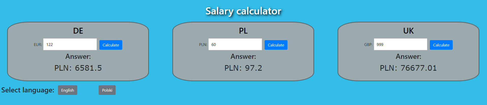

[](https://travis-ci.org/Mikbac/Salary-Calculator)

[](https://lgtm.com/projects/g/Mikbac/Salary-Calculator/context:java) [](https://lgtm.com/projects/g/Mikbac/Salary-Calculator/alerts/)


# Salary Calculator

The application converts salary to PLN.

# Table of contents
* [Adding the new country](#adding-the-new-country)
* [Added countries](#added-countries)
* [Prerequisites](#prerequisites)
* [Installing](#installing)
* [API Endpoint](#api-endpoint)
* [Built with](#built-with)

## Getting Started

### Adding the new country

* You can use POST in swagger.

```
http://localhost:8080/swagger-ui.html#/
```

* Or add countries to the `import.sql` file before running the application.

### Added countries

* United Kingdom - ```UK```
* Germany - ```DE```
* Poland - ```PL```


### Prerequisites

* Maven
* JDK 8


### Installing
1. Build and run the application:
```
mvn install
cd target   
java -jar salaryapp-1.0-SNAPSHOT.war
```

or 

```
docker build --tag mikbac/salary_app:1.0 -f Dockerfile .
docker container run -p 8080:8080 --ip 0.0.0.0 --name salary_app mikbac/salary_app:1.0
```

2. Open the browser and hit 
```
http://localhost:8080/
```

## API Endpoint
|Endpoints|Usage|Params|
|---|---|---|
|```GET /api/countries```|Get all of the countries available for the app.||
|```POST /api/countries```|Add a new countryModel.|**countryCode** - [String] <br>**tax** - [BigDecimal] <br>**fixedCosts** - [BigDecimal] <br>**currencyCode** - [String]|
|```GET /api/salaries/pln?countryCode={countryCode}&salary={salaryFromClient}```|Calculate salary.|**{countryCode}** - Country code <br>**{salaryFromClient}** - Salary|

## Example:

An example of an HTTP request is available in the ```http/question.http``` file.

## Built with

* [JDK 8](https://www.oracle.com/technetwork/java/index.html)

* [Spring Boot - 2.1.6.RELEASE](https://spring.io/projects/spring-boot) 

* [Thymeleaf](https://www.thymeleaf.org/) 

* [Maven](https://maven.apache.org/)

* [Log4j 2](https://logging.apache.org/log4j/2.x/)

* [HSQLDB](http://hsqldb.org/)

* [JUnit 5](https://junit.org/junit5/)

* [HTML5]()

* [Less CSS](https://lesscss.org/)

The application uses the [NBP Web API](http://api.nbp.pl/). 

## Example of features


